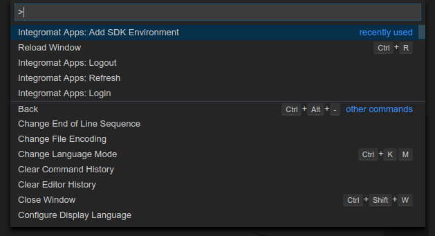
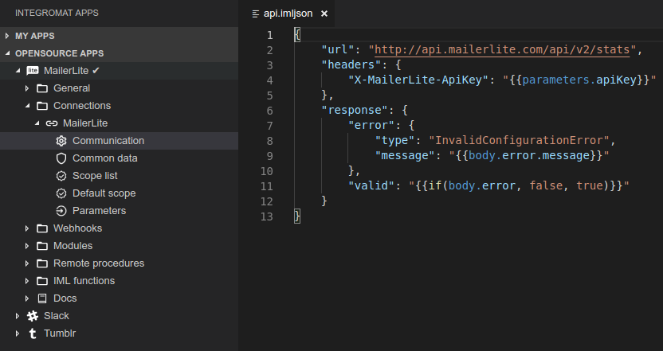
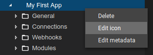
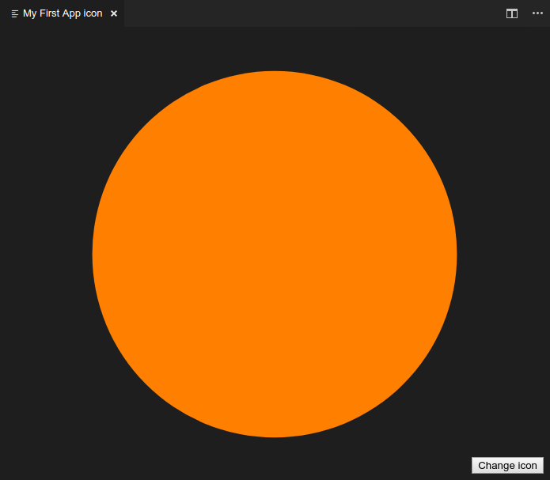
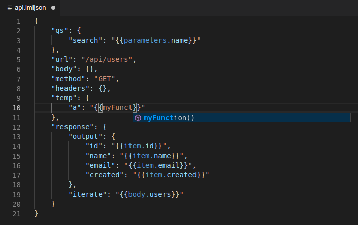
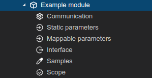
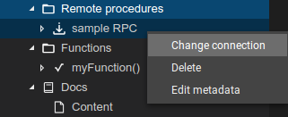
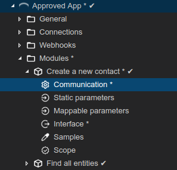
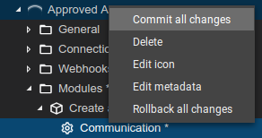

# Integromat Apps SDK plugin for Visual Studio Code

## Features

- Source code editor with syntax highlighter and hints
- Icon editor
- Version control
- Apps control (CRUD modules, RPCs, connections, ...)
- Documentation editor
- Faster and more comfortable than the web interface
- Everything at one place

## First launch guide

### Adding an environment

After installing the extension, the Integromat icon will appear in your sidebar.
The extension will be activated automatically after clicking this icon.
The extension will inform you, that you don't have any environment to load.

You can launch the environment setup by clicking the `Add environment` button directly from the popup or by issuing the command: `Add SDK enviroment` from the command palette. 

A text input prompt will appear with prefilled Integromat API URL `api.integromat.com`. If you don't want to connect to a private Integromat Cloud Service, just confirm this URL by pressing the Enter key.

In the next dialog you'll be asked to name the environment. For the Integromat API URL the name defaults to `Integromat: Production`, but you can use any name you want. Confirm the name by pressing the Enter key.

The last dialog will ask you for your Integromat API key. You can get your API key from the [web interface](https://www.integromat.com). 

And that's it. You're all set. The extension will restart with the configuration you've just entered and will connect to the Integromat.

### Opensource Apps

Once you're logged in, you have an access to Opensource apps. They are read only and they are here to help you learning how the Apps platform work and how to write the sources.

### Environment change

You can find the active environment indicator in the bottom status bar.

When you click the environment indicator, you'll be able to switch between multiple environments, if you have multiple configurations running.

You can add another environment by issuing the `Add SDK environment` again. You can logout using the `Logout` command and log back in by `Login` command.

## Your first app

### Creating the app

When you're successfully logged in and you have the environment set, it's time to develop your first app. To start, call the `+` icon in the header of `My apps` section or call the `New app` command directly from the command palette.

At first, you'll be asked to fill in a label. That's how the app will be displayed to users.

Next, the app id will be generated for you. It will be used in URL paths and so. You can change it, however it should be clear to which app does it lead. It has to match `(^[a-z][0-9a-z-]+[0-9a-z]$)` regular expression.

Then you'll be asked to enter a color theme of your app. That's the color of app modules used in scenarios.

The next prompt will ask for app language. That's the language of the interface of the app. Most of the apps in the Integromat are currently in English.

The last prompt is for countries where the app will be available. If you don't pick any country, the app will be considered as global and it will be accessible all aroud the world.

And that's it. After you confirm the last dialog, your brand new app will appear in the `My apps` view and you can start coding.

### Setting or changing the icon

To view, set or change the icon of app click the right mouse button on the app name and choose the `Edit icon` option.

A new view will appear and you'll see the preview of the current app icon as the app module.

You can change the icon by clicking the `Change icon` button. The icon has to be in PNG format, exactly 512x512 pixel sized. The file upload dialog will appear and after you confirm the chosen icon, it will be uploaded to the Integromat. The change icon view will close and the new icon will appear in the left tree.

## General controls of the Apps SDK

### Editing the source code

To start editing the source code, simply find the item you want to edit in the left menu and click it. A new editor will appear and the current source will be downloaded from the Integromat.

You can edit it as a normal file. If your app contains some RPCs or IML functions, they'll be provided to you, if it's possible in the currently edited code.

After pressing `CTRL+S`, the source code will be automatically uploaded back to the Integromat.

### Adding a new item

To add a new item, such a module, connection, webhook or anything else, right click the corresponding folder and click the `New <item>` option.

Each time the prompt will appear and you'll be asked to fill in some information about the newly created item. Just goo through it. Your new items will always appear under the corresponding folder.

### Editing metadata

To edit metadata (for example to change the label of the module) right click the desired item and choose the `Edit metadata` option

The prompt will appear and you'll be able to change allowed values. If you don't want to change some value, just skip the field by pressing the Enter key.

### Changing the connection or webhook

To change attached connection or webhook of an item right click the item and choose the `Change connection (or webhook)` option.

The prompt will appear and you'll be able to change the connection or webhook. If it's possible, there will be also an option to unassign the current connection without assigning any new.

### Deleting an item

To delete an item, right click it and choose the `Delete` option.

You will be asked to confirm the deletion. If you answer `Yes`, the item will be deleted from the app.

## Changes and versioning

When your app becomes approved by the Integromat (that means it's publicly visible and it's shown in the scenario builder as well), it starts to be versioned. From this moment, every change made to the app is visible only for you unless you commit it. You can safely add and test new functions and when they are stable, you can release them for users. The changes are marked with `*` next to the name of the app or changed item.

To view what's changed right click the item and pick the `Show changes` option.

A compare view will appear and you'll see the changes that have been made.

You can either commit or rollback changes in the app. To do so, right click the app and choose the corresponding option. Then confirm that you know what you're doing and it's done. Remember, all commited changes are immediatelly effective and visible to users of your app.

*Commiting or rolling back only one change is currently not supported on our side, but we're planning to add this feature as soon as possible.*

## VS Code tips

Here are some tips for better performance and experience:

- Set `editor.formatOnSave` to `true` in VS Code settings. Source codes will be formated automatically when you save them.
- Set `editor.quickSuggetions.strings` to `true` in VS Code settings. Keyword recommendations will automatically show up while you're typing in IML strings too.